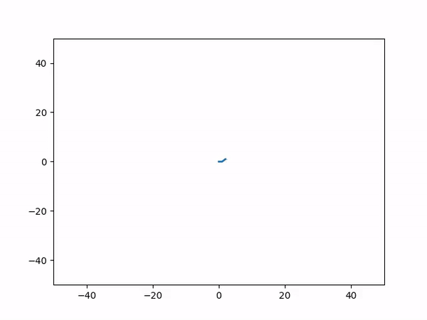

# Random-Walk
A simple visualization for random walks in 2 dimensional space.

TODO:
clean up everything - the files are all over the place and functions are defined in strange places.  
add auto-scaling axes
add support for multiple particle diffusion
add support for single/multiple particle diffusion with momentum
